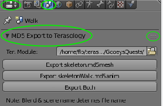

 
# How to create animated models for terasology with Blender

## Step 1: Download Blender
Download Blender. The latest test with this addon has been made with Blender 2.77 but newer versions will probably work as well.

## Step 2: Installing the addon
There are theortically multiple addons that can be used. The addon  with the simplest and most powerful export is currently the addon you can get at https://github.com/MovingBlocks/TeraMisc/tree/master/blender_addons/io_md5_exporter

Please note that how you have to perpare the model differs between the different addons as there is no standarized way in Blender on how to represent multiple animations for game models.

To install the addon download it from [https://github.com/MovingBlocks/TeraMisc/tree/master/blender_addons/io_md5_exporter ]. Then use the menu File -> User Preferences to open the user settings. In the tab "Add-ons" select there at the bottom "Install From File". (Note: It is also possible to install a file by copying it to a specific location. Just google for it)

After the file has been installed you need to activate it. So just search for "MD5 exporter for Terasology" and activate the addon in the list of the user preferences dialog.

Afterwards you might want to save the user preferences so that the module is activate again when you restart Blender.

## Step 3: Customize the interface and save it
Blender allows you to adjust the interface so that it matches your needs. There are other tutorials on that but what I would recommend doing the following:
* Configure yourself a rectangular region with a properties editor that has the scene tab active and the "MD5 Export to Terasology" panel active
* In the "MD5 Export to Terasology" panel select the path of the terasology module you are working on. This path gets saved with the user preferences.

## Step 4: Learn how to export an existing model

first I suggest you download skeleton.blend from https://github.com/MetaTerasology/GooeysQuests/blob/master/gooey/ as it is a model that has already been prepared for the export with this addon. Thus you can check with it that the export works and learn with it before trying to prepare your own model for export.

The addon expects each Blender Scene to represent one animation of the model. In a default Blender layout the active scene can be selected at the top.

So for exporting you would first double check that the scene properties tab "MD5 Export to Terasology" has the terasology module selected to which you want to export the module to. Then you simply click on either "Export Both". The button for exporting just the animation did not work yet at the time at which this tutorial got written. The names of the 2 buttons indicate however how the files will be called. It's based on the name of the blend file and the name of the scene.

## Step 5: Learn how to add an animation to an existing model
Right next to the combo box where you can select the active scene is a + Button. Click on that button and select "Link Object data".

Open a drop sheet editor in a region of Blender and select the armature (the bones) while in object mode.
In the drop sheet editor there should be an action selected (possibly you need to scroll the drop sheet menu to the left with the mouse wheel to see it). There should be currently a "2" being displayed next to the action name. Click first on that 2 to duplicate the action. Then rename the action and edit it as you like. Otherwise you edit the action of the animation you intended to copy.

The Length of the animation gets determined by the length of the animation of the scene. So for example in the timeline editor of Blender you can set the "Start" and "End" frame of the animation. I suggest setting "Start" to 1 as that is common for Blender models. Each of your animations can have a custom length.

## Step 6: Learn how to make your own model

There are a lot of tutorials on how to create animated models in Blender so I would not go into details here.

Some tipps:
* There are addons that allow you to generate from a simple bone structure control elements that allow easy animation. One powerful module that does this is called Rigify. There are tutorials on that too. Just google.
